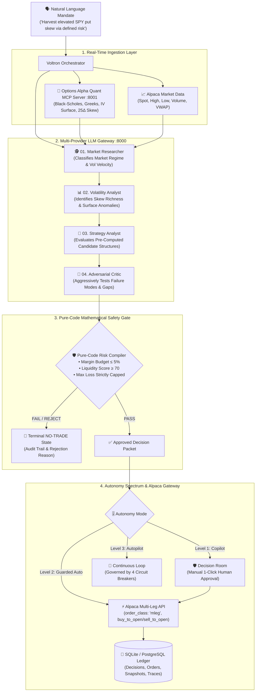

<div align="center">

# ⚡ VOLTRON
### Institutional AI Options Structuring & Autonomous Execution System
**Built for the Alpaca AI Tradathon 2026**

[](https://www.python.org/downloads/)
[](https://fastapi.tiangolo.com)
[](https://nextjs.org/)
[](https://github.com/anishraj836/AlpecaAITradathon)
[](https://alpaca.markets/)
[](https://github.com/anishraj836/AlpecaAITradathon)

> **"Find the edge. Stress the thesis. Compile the risk. Trade only what survives."**

[Live Demo](http://localhost:3000) • [Architecture](#-system-architecture) • [Autonomy Spectrum](#-the-3-tier-autonomy-spectrum) • [Multi-Provider LLM Gateway](#-multi-provider-llm-gateway) • [Circuit Breakers](#-level-3-portfolio-autopilot--circuit-breakers) • [Quickstart](#-1-minute-quickstart)

</div>

---

## 🎯 Executive Summary (The 30-Second Pitch)

Most AI trading bots blindly ask a single LLM: *"Should I buy Nvidia?"* and let the model hallucinate unhedged market orders. 

**VOLTRON takes the opposite, institutional approach:**
1. **Adversarial Multi-Agent Debate:** 4 specialized agents (**Researcher $\rightarrow$ Volatility Analyst $\rightarrow$ Strategy Analyst $\rightarrow$ Adversarial Critic**) analyze market microstructure, 3D volatility skew, and structural breakout vulnerabilities.
2. **Pure-Code Deterministic Risk Compiler:** The LLM *cannot* touch broker execution directly. Only a mathematically rigorous Python gate enforces budget caps, liquidity scores, and max loss ceilings.
3. **The 3-Tier Autonomy Spectrum:** Operates across a configurable governance spectrum from **Level 1 (Human Copilot)** to **Level 2 (Guarded Autonomous Agent)** to **Level 3 (Portfolio Autopilot with 4 Circuit Breakers)**.
4. **Radical Transparency Protocol:** Zero "fake AI" theater. If an LLM provider hits rate limits or goes offline, the system explicitly flags degraded mode and automatically activates **Safety Demotion** (forcing human review).
5. **Real Atomic Broker Execution:** Compiles multi-leg options combinations (Iron Condors, Vertical Spreads) into atomic payloads routed directly to the **Alpaca Multi-Leg Options API (`order_class: "mleg"`)**.

---

## 🌟 Why VOLTRON Stands Out

| Feature | Typical AI Trading Bot | VOLTRON |
|---|---|---|
| **AI Strategy** | Single prompt asking LLM for price predictions. | **4-Agent Deliberative Graph** (Researcher $\rightarrow$ Vol Analyst $\rightarrow$ Strategist $\rightarrow$ Adversarial Critic). |
| **Model Agility** | Locked to a single proprietary API. | **Provider-Agnostic LLM Gateway** (Google Gemini, OpenAI GPT-4o, Groq LPU, Anthropic Claude, DeepSeek, Local Ollama). |
| **Autonomy Control** | Binary (either pure chatbot or blind auto-bot). | **3-Tier Autonomy Spectrum** (Level 1 Copilot, Level 2 Guarded Auto, Level 3 Autopilot). |
| **Fail-Safe Governance** | Silent fallback or uncontrolled crashing. | **Radical Transparency & Safety Demotion**: Auto-locks autonomous trading when AI is degraded. |
| **Financial Instruments** | Simple single-stock buy/sell orders. | **Institutional Multi-Leg Options** (4-Leg Iron Condors, 2-Leg Put/Call Credit Spreads). |
| **Broker Execution** | Basic stock orders. | Real atomic **Alpaca Multi-Leg API (`order_class: "mleg"`)** with `buy_to_open` & `sell_to_open` Level 3 intents. |
| **Quantitative Math** | Simple indicators (RSI, MACD). | **Black-Scholes analytical engine**, 3D parametric volatility surfaces, 25Δ skew ratios, and lognormal POP. |
| **Trade Lifecycle** | None. User waits 30 days for expiration. | **Interactive Fast-Forward Simulator** (+7D Theta, +14D Win, Shock) + **Plan vs. Actual Attribution Scorecard**. |

---

## 🎚️ The 3-Tier Autonomy Spectrum

```
Level 1: Copilot (Advisory) ──► Level 2: Guarded Agent ──► Level 3: Portfolio Autopilot
         [ 30% Auto ]                   [ 80% Auto ]                [ 100% Auto ]
```

```
                                AUTONOMY SPECTRUM
 ┌─────────────────────────┬─────────────────────────┬─────────────────────────┐
 │   LEVEL 1: COPILOT      │ LEVEL 2: GUARDED AUTO   │  LEVEL 3: AUTOPILOT     │
 │   (Human-In-The-Loop)   │   (Default Hackathon)   │   (Continuous Engine)   │
 ├─────────────────────────┼─────────────────────────┼─────────────────────────┤
 │ • AI Committee debates  │ • AI Committee debates  │ • Continuous background │
 │ • Quant gate verifies   │ • Quant gate verifies   │   market open scanning  │
 │ • Execution PAUSED at   │ • Auto-dispatches to    │ • Dynamic portfolio     │
 │   Decision Room         │   Alpaca Paper on 100%  │   delta-neutral hedging │
 │ • Human 1-Click Approval│   Risk Compiler Pass    │ • Governed by 4 Active  │
 │   strictly required     │ • Auto-locks if degraded│   Circuit Breakers      │
 └─────────────────────────┴─────────────────────────┴─────────────────────────┘
```

---

## 🛑 Level 3: Portfolio Autopilot & Circuit Breakers

When running in autonomous background mode, VOLTRON is protected by **4 Non-Bypassable Deterministic Circuit Breakers**:

1. **Intraday Drawdown Gate (Hard Capital Stop):** If net daily portfolio P&L drops by **$\ge 2.0\%$**, all automated execution freezes immediately and open orders are canceled.
2. **Greek Drift Ceiling:** If $|\text{Net Portfolio } \Delta| > 0.30$ or single-ticker margin $> 40\%$, the agent is locked from adding directional exposure and restricted to delta-hedging.
3. **Adversarial Cooldown (Regime Shift Guard):** If the Risk Compiler or Critic rejects **3 consecutive candidate structures**, Autopilot enters a 15-minute cooldown to prevent churn.
4. **1-Click Operator Kill-Switch:** Instant operator freeze accessible in the UI and API (`POST /api/emergency/halt`).

---

## 🚨 Radical Transparency & Safety Demotion Protocol

In financial systems, silently pretending an AI is thinking when the LLM is actually dead or quota-exhausted is dangerous. VOLTRON enforces **Radical Transparency**:

```
                       ┌──────────────────────────────────┐
                       │  LLM Call Fails / Quota Runs Out │
                       └─────────────────┬────────────────┘
                                         │
                 ┌───────────────────────┼───────────────────────┐
                 ▼                       ▼                       ▼
      ┌─────────────────────┐ ┌─────────────────────┐ ┌─────────────────────┐
      │ 1. VISIBLE UI ALERT │ │  2. TRACE AUDIT     │ │ 3. SAFETY DEMOTION  │
      │ "⚠️ LLM Offline -    │ │ Trace explicitly   │ │ Autonomous Mode is  │
      │  Degraded Mode"     │ │ tags step as        │ │ LOCKED; trade MUST  │
      │                     │ │ [HEURISTIC_FALLBACK]│ │ be human-approved   │
      └─────────────────────┘ └─────────────────────┘ └─────────────────────┘
```

---

## 🏛️ System Architecture



---

## 🧩 Multi-Provider LLM Gateway

VOLTRON can switch between any LLM provider via `.env` or live in the UI **⚙️ Settings Modal**:

```bash
# 1. Google Gemini (Default - Free Tier)
LLM_PROVIDER=gemini
GEMINI_API_KEY=your_gemini_api_key
GEMINI_MODEL=gemini-3.5-flash-lite

# 2. OpenAI (GPT-4o / GPT-4o-mini)
LLM_PROVIDER=openai
OPENAI_API_KEY=sk-...
OPENAI_MODEL=gpt-4o-mini

# 3. Groq Cloud (Ultra-Fast 600 tok/sec LPU - Free Tier)
LLM_PROVIDER=groq
GROQ_API_KEY=gsk_...
GROQ_MODEL=llama-3.3-70b-versatile

# 4. Anthropic Claude (Claude 3.5 Sonnet / Haiku)
LLM_PROVIDER=anthropic
ANTHROPIC_API_KEY=sk-ant-...
ANTHROPIC_MODEL=claude-3-5-haiku-20241022

# 5. Local Ollama (100% Offline & $0.00)
LLM_PROVIDER=ollama
OLLAMA_BASE_URL=http://localhost:11434
OLLAMA_MODEL=llama3.2:3b
```

---

## 🖥️ Screen-by-Screen Feature Tour

### 1. Command Center (`/terminal`)
* Real-time natural language mandate input with voice dictation and quick chips (`SPY`, `QQQ`, `AAPL`, `NVDA`, `TSLA`).
* **Autonomy Spectrum Toggle:** Switch between *Level 1 Copilot*, *Level 2 Guarded Auto*, and *Level 3 Autopilot*.
* **Live SSE Progress Stream:** Watch the 4-agent graph deliberate step-by-step in real-time.

### 2. ⚙️ Zero-Setup Settings Modal
* Accessible via top header **⚙️ [LLM: ACTIVE]** button.
* Paste API keys, change model identifiers, and test live connection ping with latency benchmarks.

### 3. 3D Volatility Mesh Canvas (`/surface`)
* Interactive 3D parametric surface visualizing Implied Volatility across Strikes ($K$) and Expirations ($T$).
* 2D Volatility Smile curve and 30D Skew Snapshot displaying 25Δ Put vs 25Δ Call skew ratio.

### 4. Strategy Candidate Tournament (`/tournament`)
* Dynamic candidate leaderboard ranking Iron Condors, Put Credit Spreads, and Call Credit Spreads.
* Full transparency table showing rejected structures and deterministic rejection reasons.

### 5. Payoff & Stress Matrix Lab (`/stress`)
* 15-cell Stress Scenario Matrix simulating P&L outcomes across $\pm 3\%$ Underlying Spot Price shifts and $\pm 20\%$ Implied Volatility shocks.

### 6. Interactive Portfolio & Lifecycle Simulator (`/portfolio`)
* Live Alpaca account equity, cash balance, and open position tracking.
* **Fast-Forward Lifecycle Simulator**: Interactive time-warp controls (`+7 Days Theta Decay`, `+14 Days 50% Win`, `-3% Market Shock`, `Reset Live`).

### 7. AI Consensus Trace (`/trace/[id]`)
* Chronological agent deliberation ledger with explicit `[LLM: GEMINI]` vs `[FALLBACK HEURISTIC]` badges on every step.

---

## 🏆 Judges' Rubric Alignment

| Judging Criterion | How VOLTRON Delivers | Where in Code |
|---|---|---|
| **Technical Innovation & Architecture** | 3-tier microservice architecture separating LLM reasoning, quantitative pricing (MCP), and execution safety. | [`apps/api/app/agents/orchestrator.py`](apps/api/app/agents/orchestrator.py) |
| **Agentic Complexity & AI Quality** | Provider-agnostic 4-agent graph (Gemini, OpenAI, Groq, Claude, Ollama) with structured Pydantic schema enforcement. | [`apps/api/app/infrastructure/llm/`](apps/api/app/infrastructure/llm/) |
| **Autonomy & Safety Governance** | 3-Tier Autonomy Spectrum (Copilot $\rightarrow$ Guarded Auto $\rightarrow$ Autopilot) + Radical Transparency & Safety Demotion. | [`apps/api/app/agents/orchestrator.py`](apps/api/app/agents/orchestrator.py) |
| **Alpaca API Integration Depth** | Full multi-leg options integration (`order_class: "mleg"`) with Level 3 intents (`buy_to_open` & `sell_to_open`). | [`apps/api/app/infrastructure/alpaca/trading.py`](apps/api/app/infrastructure/alpaca/trading.py) |
| **Financial & Quantitative Rigor** | Analytical Black-Scholes pricing, Greeks, 3D SVI surface modeling, and pure-code deterministic risk compiler. | [`packages/options-alpha-mcp/`](packages/options-alpha-mcp/) |
| **UX / UI & Product Completeness** | Next.js 14 UI, ⚙️ Settings Modal, 3D volatility mesh, SSE streaming, decision replay, and fast-forward simulator. | [`apps/web/src/`](apps/web/src/) |
| **Reliability & Test Coverage** | **47 / 47 backend tests passing** + 17 quantitative math tests covering all edge cases. | [`apps/api/tests/`](apps/api/tests/) |

---

## ⚡ 1-Minute Quickstart

### Prerequisites
* Python 3.11+
* Node.js 18+ and npm
* Alpaca Paper Trading API Keys
* Google Gemini API Key (or OpenAI / Groq / Anthropic / Ollama)

### 1. Environment Configuration
Create a `.env` file in the root directory:
```ini
ALPACA_API_KEY=your_alpaca_paper_api_key
ALPACA_SECRET_KEY=your_alpaca_paper_secret_key
ALPACA_PAPER=true
ALPACA_BASE_URL=https://paper-api.alpaca.markets
ALPACA_DATA_URL=https://data.alpaca.markets

LLM_PROVIDER=gemini
GEMINI_API_KEY=your_google_gemini_api_key
GEMINI_MODEL=gemini-3.5-flash-lite

AUTONOMY_LEVEL=GUARDED_AUTONOMOUS
AUTONOMOUS_EXECUTION=true
DATABASE_URL=sqlite+aiosqlite:///./voltron.db
USE_MOCK_QUANT=false
```

### 2. Start All 3 Services

```bash
# 1. Start Quant Options Alpha MCP Server (Port 8001)
PYTHONPATH=packages/options-alpha-mcp python3 -m uvicorn server:app --host 0.0.0.0 --port 8001 &

# 2. Start FastAPI Backend (Port 8000)
PYTHONPATH=apps/api:packages/options-alpha-mcp python3 -m uvicorn app.main:app --host 0.0.0.0 --port 8000 &

# 3. Build & Start Next.js Web Frontend (Port 3000)
npm install
npm --workspace=apps/web run build
npm --workspace=apps/web run start
```

### 3. Open in Browser
* **Web UI:** [http://localhost:3000](http://localhost:3000)
* **Command Terminal:** [http://localhost:3000/terminal](http://localhost:3000/terminal)
* **Portfolio & Simulator:** [http://localhost:3000/portfolio](http://localhost:3000/portfolio)
* **FastAPI Docs:** [http://localhost:8000/docs](http://localhost:8000/docs)

---

## 🧪 Test Suite Execution

```bash
# Run all 47 backend unit & integration tests
PYTHONPATH=apps/api:packages/options-alpha-mcp pytest apps/api/tests -v

# Run quantitative Black-Scholes math verification
PYTHONPATH=packages/options-alpha-mcp python3 -c "from pricing import black_scholes_price, black_scholes_greeks; print('Quant Math Verified!')"

# Run frontend Next.js production build
npm --workspace=apps/web run build
```

---

## 🔒 Security & Fail-Closed Guardrails

1. **Deterministic Risk Gate:** LLMs can suggest strategies, but **only pure Python code** can compile and approve order payloads.
2. **Safety Demotion:** If the LLM is unconfigured or rate-limited, autonomous execution is **automatically locked** and forces human review.
3. **Paper Safety Hard-Lock:** Execution services default strictly to `ALPACA_PAPER=true`.
4. **Idempotency & Concurrency Mutexes:** Per-decision asynchronous locks prevent double-dispatch under rapid user interactions.
5. **Zero Key Leakage:** All API keys are isolated in git-ignored `.env` files or entered securely client-side in the Settings modal.

---

## 📄 License
MIT License. Built with pride for the Alpaca AI Tradathon 2026.
