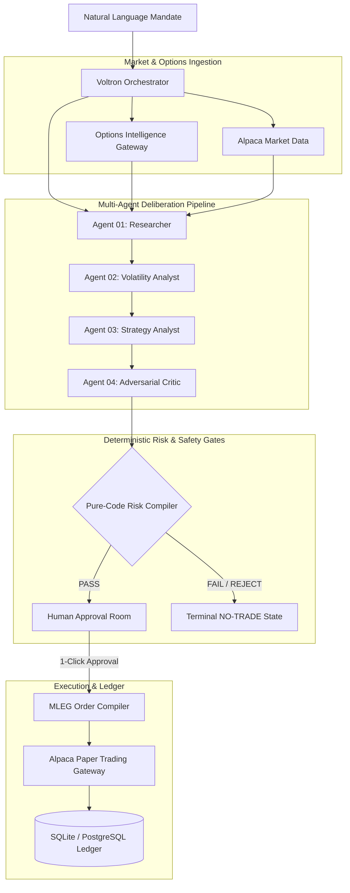

# ⚡ VOLTRON | Strategic AI Options Decision System

> **"Find the edge. Stress the thesis. Trade only what survives."**

VOLTRON is an autonomous, deliberative AI options decision and risk-compilation system built on the **Alpaca Options API**. Rather than using probabilistic language models to generate orders directly, VOLTRON uses an adversarial multi-agent debate architecture paired with a **deterministic pure-code Risk Compiler** to evaluate, stress-test, and execute defined-risk multi-leg options structures.

---

## 🏛️ System Architecture



---

## 🤖 The Multi-Agent Reasoning Graph

| Agent | Role | Responsibility |
|---|---|---|
| **01. Researcher** | Market Context & Regime | Ingests spot price, intraday dispersion, volume, and macro calendar to classify market regimes (e.g. *Range-bound consolidation*). |
| **02. Volatility Analyst** | Skew & Term Structure | Scans 3D implied volatility surfaces, detects statistical anomalies, and calculates 25Δ put/call skew ratios. |
| **03. Strategy Analyst** | Structure Selection | Evaluates pre-computed candidate structures (Iron Condors, Spreads) matching the thesis without hallucinating strikes. |
| **04. Adversarial Critic** | Thesis Invalidation | Stress-tests selected candidates against upside/downside gap scenarios and identifies primary failure modes. |
| **05. Risk Compiler** | Deterministic Gate | Pure-code mathematical checks enforcing portfolio risk budgets, liquidity thresholds ($\ge 70$), and concentration limits. |

---

## 🖥️ Web Interface Features

- **Command Center (`/terminal`)**: Natural language mandate dispatching with real-time SSE deliberation streaming.
- **3D Volatility Surface (`/surface`)**: Interactive 3D surface plot, Volatility Smile, Skew Snapshot, and Anomaly Detection cards.
- **Opportunity Scanner (`/tournament`)**: Candidate leaderboard ranked by score/POP with an audit trail of rejected structures.
- **Decision Room (`/decision/[id]`)**: Hero decision ticket with thesis rationale, 4-leg payoffs, Greeks, and 1-click Alpaca Paper approval.
- **Payoff & Stress Lab (`/stress`)**: 15-cell Spot Price ($\pm 3\%$) vs. IV Shift ($\pm 20\%$) stress test matrix with max profit zones.
- **AI Agent Trace (`/trace/[id]`)**: Interactive multi-agent consensus graph detailing timestamp offsets, driver evidence, and confidence scores.
- **Counterfactual Lab (`/counterfactual`)**: Dynamic sensitivity sliders (Delta, DTE, Budget) showing strategy shifts under alternative parameters.
- **Decision Replay (`/replay/[id]`)**: Animated deliberative replay timeline with scrub controls.
- **Decision History (`/history`)**: Historical session ledger tracking executed trades, risk amounts, POP, and realized outcomes.

---

## 🚀 Quickstart Guide

### Prerequisites
- Python 3.11+
- Node.js 18+ and npm

### 1. Backend Setup & Startup
```bash
# Navigate to API directory
cd apps/api

# Install dependencies
pip install -r requirements.txt

# Start FastAPI Backend (Port 8000)
PYTHONPATH=. python3 -m uvicorn app.main:app --host 0.0.0.0 --port 8000 --reload
```

### 2. Frontend Setup & Startup
```bash
# From repository root
npm install

# Start Next.js Development Server (Port 3000)
npm --workspace=apps/web run dev
```

### 3. Accessing the Application
- **Web UI:** [http://localhost:3000](http://localhost:3000)
- **FastAPI OpenAPI Docs:** [http://localhost:8000/docs](http://localhost:8000/docs)
- **Backend Health Check:** [http://localhost:8000/api/health](http://localhost:8000/api/health)

---

## 🧪 Testing & Verification

The repository includes a comprehensive 42-test suite covering agents, API routes, database persistence, Alpaca normalizers, lifecycle transitions, and race conditions:

```bash
# Run all backend tests
PYTHONPATH=apps/api pytest apps/api/tests -v

# Run frontend typecheck & linting
npm --workspace=apps/web run typecheck
npm --workspace=apps/web run lint

# Run full end-to-end integration demo script
python3 scripts/e2e_demo.py
```

---

## 🔒 Safety & Risk Architecture

1. **Deterministic Execution Gate:** No LLM can place an order directly. All trades must pass pure-code mathematical risk gates and require explicit human approval.
2. **Paper Trading Hard-Lock:** Execution services strictly enforce `ALPACA_PAPER=true` to prevent accidental live-account order routing.
3. **Idempotency & Concurrency Locks:** Per-decision asynchronous mutexes and database unique constraints prevent duplicate order dispatch under concurrent approval requests.

---

## 👥 Division of Responsibility & MCP Integration

- **Person 2 (This Codebase):** Complete FastAPI backend, multi-agent runtime pipeline, SQLite/PostgreSQL persistence, Alpaca BrokerGateway, MLEG order compiler, and Next.js frontend.
- **Person 1:** Quantitative engine & Voltron MCP server (`packages/options-alpha-mcp/`) communicating via JSON-RPC 2.0 on `http://localhost:8001/rpc`.

---

## 📄 License
MIT License. Built for the Alpaca AI Tradathon.
