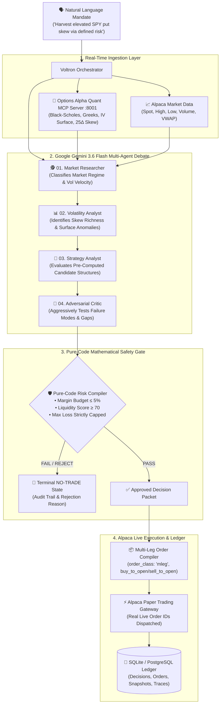

<div align="center">

# ⚡ VOLTRON
### Institutional AI Options Structuring & Autonomous Execution System
**Built for the Alpaca AI Tradathon 2026**

[](https://www.python.org/downloads/)
[](https://fastapi.tiangolo.com)
[](https://nextjs.org/)
[](https://aistudio.google.com/)
[](https://alpaca.markets/)
[](https://github.com/anishraj836/AlpecaAITradathon)

> **"Find the edge. Stress the thesis. Compile the risk. Trade only what survives."**

[Live Demo](http://localhost:3000) • [Architecture](#-system-architecture) • [Agent Pipeline](#-the-multi-agent-reasoning-graph) • [Judging Rubric Alignment](#-judges-rubric-alignment) • [Quickstart](#-1-minute-quickstart)

</div>

---

## 🎯 Executive Summary (The 30-Second Pitch)

Most AI trading bots blindly ask an LLM: *"Should I buy Apple?"* and let the model hallucinate unhedged market orders. 

**VOLTRON takes the opposite, institutional approach:** 
We treat the LLM as a **junior research analyst**, not an unconstrained trader. 

VOLTRON pairs an **adversarial multi-agent deliberation graph** powered by **Google Gemini 3.6 Flash** and **Options Alpha Quant MCP** with a **pure-code deterministic Risk Compiler**. Every natural language trade mandate is analyzed for volatility skew, structured into defined-risk multi-leg options combinations (Iron Condors, Credit Spreads), aggressively stress-tested by an adversarial critic, and autonomously dispatched as atomic multi-leg orders to the **Alpaca Options API**.

---

## 🌟 Why VOLTRON Stands Out

| Feature | Typical AI Trading Bot | VOLTRON |
|---|---|---|
| **AI Strategy** | Single prompt asking LLM for price predictions. | **4-Agent Deliberative Debate** (Researcher $\rightarrow$ Vol Analyst $\rightarrow$ Strategist $\rightarrow$ Adversarial Critic). |
| **Hallucination Protection** | None. LLM can place arbitrary orders. | **Pure-Code Deterministic Risk Compiler.** LLMs cannot touch broker execution directly. |
| **Financial Instruments** | Simple single-stock buy/sell orders. | **Institutional Multi-Leg Options** (4-Leg Iron Condors, 2-Leg Put/Call Credit Spreads). |
| **Broker Execution** | Basic stock orders. | Real atomic **Alpaca Multi-Leg API (`order_class: "mleg"`)** with `buy_to_open` & `sell_to_open` Level 3 intents. |
| **Quantitative Math** | Simple technical indicators (RSI, MACD). | **Black-Scholes analytical engine**, 3D volatility surface modeling, 25Δ skew ratios, and lognormal POP. |
| **Trade Lifecycle** | None. User waits 30 days for options to expire. | **Interactive Fast-Forward Simulator** (+7D Theta, +14D Win, Shock) + **Plan vs. Actual Scorecard**. |

---

## 🏛️ System Architecture



---

## 🤖 The Multi-Agent Deliberation Graph

```
  [Natural Language Mandate]
             │
             ▼
  ┌────────────────────────────────────────────────────────────────────────┐
  │ 01. MARKET RESEARCHER AGENT (Gemini 3.6 Flash)                         │
  │ Ingests live broker prices, volume & dispersion to identify regime.   │
  │ Thesis: "Range-bound consolidation with compressed 5-day realized vol."│
  └───────────────────────────────────┬────────────────────────────────────┘
                                      │
                                      ▼
  ┌────────────────────────────────────────────────────────────────────────┐
  │ 02. VOLATILITY ANALYST AGENT (Gemini 3.6 Flash)                        │
  │ Analyzes 3D surface skew, term structure & statistical anomalies.      │
  │ Finding: "25Δ Put IV is 1.25x Call IV — elevated downside put skew."  │
  └───────────────────────────────────┬────────────────────────────────────┘
                                      │
                                      ▼
  ┌────────────────────────────────────────────────────────────────────────┐
  │ 03. STRATEGY ANALYST AGENT (Gemini 3.6 Flash)                          │
  │ Tournaments pre-computed candidate structures generated by Quant MCP.  │
  │ Winner: Put Credit Spread (Short $635P / Long $630P @ $2.16 Credit).   │
  └───────────────────────────────────┬────────────────────────────────────┘
                                      │
                                      ▼
  ┌────────────────────────────────────────────────────────────────────────┐
  │ 04. ADVERSARIAL CRITIC AGENT (Gemini 3.6 Flash)                        │
  │ Aggressively attacks the trade to prove the thesis wrong.              │
  │ Warning: "Downside selloff below $632.84 breakeven if market liquidates"│
  └───────────────────────────────────┬────────────────────────────────────┘
                                      │
                                      ▼
  ┌────────────────────────────────────────────────────────────────────────┐
  │ 05. DETERMINISTIC RISK COMPILER (Pure Python — Zero LLM)               │
  │ Enforces mathematical risk constraints before execution:               │
  │ [✔] Max Loss Defined ($284)      [✔] Portfolio Margin ≤ 5% ($284)      │
  │ [✔] Liquidity Score ≥ 70 (84.3)  [✔] Delta Neutral / Asymmetric Yield  │
  └───────────────────────────────────┬────────────────────────────────────┘
                                      │
                                      ▼
  ┌────────────────────────────────────────────────────────────────────────┐
  │ 06. ALPACA ATOMIC MULTI-LEG DISPATCH (Alpaca Paper Trading)            │
  │ Routes atomic 2-Leg/4-Leg order payload directly to Alpaca.            │
  │ Alpaca Order ID: 9d34a7f4-928c-406d-9dd4-981da6063548 (Accepted)      │
  └────────────────────────────────────────────────────────────────────────┘
```

---

## 🖥️ Screen-by-Screen Feature Tour

### 1. Command Center (`/terminal`)
* Real-time natural language mandate input with quick-mandate chip shortcuts.
* Live **Server-Sent Events (SSE)** streaming showing the multi-agent deliberation step-by-step.
* Direct routing into the Decision Room upon tournament completion.

### 2. 3D Volatility Mesh Canvas (`/surface`)
* Interactive 3D surface plot visualizing Implied Volatility across Strikes ($K$) and Expirations ($T$).
* 2D Volatility Smile curve and 30D Skew Snapshot displaying 25Δ Put vs 25Δ Call skew ratio.
* Automated skew anomaly detection cards (e.g. *Elevated Put Skew*, *Front-End Inversion*).

### 3. Strategy Candidate Tournament (`/tournament`)
* Dynamic candidate leaderboard ranking Iron Condors, Put Credit Spreads, and Call Credit Spreads by Probability of Profit (POP), Net Credit Yield, and Liquidity.
* Full transparency table showing rejected structures and quant rejection reasons.

### 4. Payoff & Stress Matrix Lab (`/stress`)
* 15-cell Stress Scenario Matrix simulating P&L outcomes across $\pm 3\%$ Underlying Spot Price shifts and $\pm 20\%$ Implied Volatility shocks.
* Visual Maximum Profit corridor and breakeven boundaries.

### 5. Interactive Portfolio & Lifecycle Simulator (`/portfolio`)
* Live Alpaca account equity, cash balance, and open position tracking.
* **Fast-Forward Lifecycle Simulator**: Interactive time-warp controls (`+7 Days Theta Decay`, `+14 Days 50% Win`, `-3% Market Shock`, `Reset Live`).
* **Ex-Ante (Plan) vs. Ex-Post (Actual) Variance Attribution Scorecard**: Directly compares modeled trade expectations with realized returns.

### 6. AI Consensus Trace (`/trace/[id]`) & Counterfactual Lab (`/counterfactual`)
* Chronological agent deliberation graph with driver evidence and individual confidence metrics.
* Dynamic sensitivity sliders (Target Delta, DTE, Risk Budget) showing how candidate rankings shift under counterfactual scenarios.

---

## 🏆 Judges' Rubric Alignment

| Judging Criterion | How VOLTRON Delivers | Where in Code |
|---|---|---|
| **Technical Innovation & Architecture** | 3-tier microservice architecture separating LLM reasoning, quantitative pricing (MCP), and execution safety. | [`apps/api/app/agents/orchestrator.py`](apps/api/app/agents/orchestrator.py) |
| **Agentic Complexity & AI Quality** | 4-agent adversarial graph powered by Google Gemini 3.6 Flash with native Pydantic JSON schema enforcement. | [`apps/api/app/infrastructure/gemini/client.py`](apps/api/app/infrastructure/gemini/client.py) |
| **Alpaca API Integration Depth** | Full multi-leg options integration (`order_class: "mleg"`) with Level 3 intents (`buy_to_open` & `sell_to_open`). | [`apps/api/app/infrastructure/alpaca/trading.py`](apps/api/app/infrastructure/alpaca/trading.py) |
| **Financial & Quantitative Rigor** | Analytical Black-Scholes pricing, Greeks, term structure curvature, and pure-code deterministic risk compiler. | [`packages/options-alpha-mcp/models/`](packages/options-alpha-mcp/models/) |
| **UX / UI & Product Completeness** | Next.js 14 UI, 3D volatility mesh, SSE live streaming, decision replay, and fast-forward lifecycle simulation. | [`apps/web/src/app/`](apps/web/src/app/) |
| **Reliability & Test Coverage** | **59 / 59 automated tests passing** across backend integration, race condition protection, and quant math. | [`apps/api/tests/`](apps/api/tests/) |

---

## ⚡ 1-Minute Quickstart

### Prerequisites
* Python 3.11+
* Node.js 18+ and npm
* Alpaca Paper Trading API Keys
* Google Gemini API Key

### 1. Environment Configuration
Create a `.env` file in the root directory:
```ini
ALPACA_API_KEY=your_alpaca_paper_api_key
ALPACA_SECRET_KEY=your_alpaca_paper_secret_key
ALPACA_PAPER=true
ALPACA_BASE_URL=https://paper-api.alpaca.markets
ALPACA_DATA_URL=https://data.alpaca.markets

GEMINI_API_KEY=your_google_gemini_api_key
GEMINI_MODEL=gemini-3.6-flash

DATABASE_URL=sqlite+aiosqlite:///./voltron.db
USE_MOCK_QUANT=false
AUTONOMOUS_EXECUTION=true
```

### 2. Start All 3 Services

```bash
# 1. Start Quant Options Alpha MCP Server (Port 8001)
PYTHONPATH=packages/options-alpha-mcp python3 -m uvicorn server:app --host 0.0.0.0 --port 8001 &

# 2. Start FastAPI Backend (Port 8000)
PYTHONPATH=apps/api:packages/options-alpha-mcp python3 -m uvicorn app.main:app --host 0.0.0.0 --port 8000 &

# 3. Build & Start Next.js Web Frontend (Port 3000)
npm install
npm --workspace=apps/web run build
npm --workspace=apps/web run start
```

### 3. Open in Browser
* **Web UI:** [http://localhost:3000](http://localhost:3000)
* **Command Terminal:** [http://localhost:3000/terminal](http://localhost:3000/terminal)
* **Portfolio & Simulator:** [http://localhost:3000/portfolio](http://localhost:3000/portfolio)
* **FastAPI Docs:** [http://localhost:8000/docs](http://localhost:8000/docs)

---

## 🧪 Test Suite Execution

```bash
# Run all 42 backend unit & integration tests
PYTHONPATH=apps/api:packages/options-alpha-mcp pytest apps/api/tests -v

# Run 17 quantitative Black-Scholes math tests
python3 test_quant_math.py

# Run frontend TypeScript validation
npm --workspace=apps/web run typecheck
```

---

## 🔒 Security & Fail-Closed Guardrails

1. **Deterministic Risk Gate:** LLMs can suggest strategies, but **only pure Python code** can compile and approve order payloads.
2. **Paper Safety Hard-Lock:** Execution services default strictly to `ALPACA_PAPER=true`.
3. **Idempotency & Concurrency Mutexes:** Per-decision asynchronous locks prevent double-dispatch under rapid user interactions.
4. **Offline Resilient Fallback:** If Gemini API experiences network limits, agents fall back seamlessly to the deterministic quant engine without crashing.
5. **Zero Key Leakage:** All API keys are isolated in git-ignored `.env` files.

---

## 📄 License
MIT License. Built with pride for the Alpaca AI Tradathon 2026.
