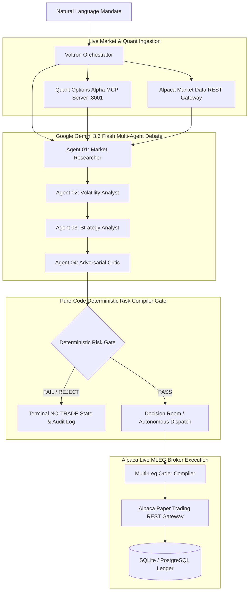

# ⚡ VOLTRON | Institutional AI Options Decision & Execution System

> **"Find the edge. Stress the thesis. Compile the risk. Trade only what survives."**

VOLTRON is an institutional-grade, multi-agent AI options structuring and autonomous execution platform built on the **Alpaca Options API** and powered by **Google Gemini 3.6 Flash**.

Rather than letting probabilistic LLMs hallucinate strikes or place unhedged orders, VOLTRON couples **Gemini-driven multi-agent adversarial deliberation** with a **deterministic pure-code Risk Compiler** and **Options Alpha Quant MCP** to structure, stress-test, and execute defined-risk multi-leg options strategies.

---

## 🏛️ System Architecture



---

## 🤖 The Multi-Agent Reasoning Graph (Google Gemini 3.6 Flash)

| Agent | Engine | Responsibility & Guardrails |
|---|---|---|
| **01. Researcher Agent** | `gemini-3.6-flash` | Ingests live SPY spot prices, intraday range, volume, and macro calendar $\rightarrow$ identifies market regime (e.g. *Range-bound consolidation*). |
| **02. Volatility Analyst** | `gemini-3.6-flash` | Scans 3D volatility surface, term structure slope, statistical anomalies, and 25Δ put/call skew ratios $\rightarrow$ explains volatility mispricing. |
| **03. Strategy Analyst** | `gemini-3.6-flash` | Evaluates pre-computed candidate structures (Iron Condors, Spreads) matching the thesis $\rightarrow$ selects the winning structure. |
| **04. Adversarial Critic** | `gemini-3.6-flash` | Acts as an adversarial risk officer $\rightarrow$ aggressively searches for failure modes, breakout vulnerabilities, and tail risks. |
| **05. Risk Compiler** | **Deterministic Code** | **Zero LLM Hallucination:** Mathematically enforces portfolio margin limits ($\le 5\%$), liquidity thresholds ($\ge 70$), and defined-risk caps. |
| **06. MLEG Order Gateway** | **Alpaca REST API** | Submits atomic multi-leg orders (`order_class: "mleg"`, `buy_to_open` & `sell_to_open`) directly to Alpaca Paper Trading. |

---

## 🖥️ Full-Stack Web Application (`apps/web`)

* **Command Terminal (`/terminal`)**: Natural language trading prompt dispatch with live Server-Sent Events (SSE) reasoning streams.
* **3D Volatility Mesh (`/surface`)**: Interactive 3D surface plot, Volatility Smile, Skew Snapshot, and Anomaly Detection cards.
* **Strategy Tournament (`/tournament`)**: Candidate leaderboard ranked by score/POP with an audit trail of rejected structures.
* **Decision Room (`/decision/[id]`)**: Hero decision ticket with thesis rationale, 4-leg payoffs, Greeks, and 1-click Alpaca Paper approval.
* **Payoff & Stress Matrix (`/stress`)**: 15-cell Spot Price ($\pm 3\%$) vs. IV Shift ($\pm 20\%$) stress test matrix with max profit zones.
* **AI Agent Trace (`/trace/[id]`)**: Interactive multi-agent consensus graph detailing timestamp offsets, driver evidence, and confidence scores.
* **Portfolio & Fast-Forward Simulator (`/portfolio`)**: 
  - Live Alpaca portfolio equity, cash, and open position tracking.
  - Interactive **Fast-Forward Simulator** (`+7 Days Theta`, `+14 Days Win`, `-3% Market Shock`).
  - **Trade Plan vs. Actual Outcome Scorecard** comparing ex-ante modeled expectations against realized outcomes.
* **Counterfactual Lab (`/counterfactual`)**: Dynamic sensitivity sliders (Delta, DTE, Budget) showing strategy shifts under alternative parameters.
* **Decision History (`/history`)**: Historical session ledger tracking executed trades, risk amounts, POP, and realized outcomes.

---

## 🚀 Quickstart & Production Setup

### Prerequisites
* Python 3.11+
* Node.js 18+ and npm
* Alpaca Paper API Keys (`ALPACA_API_KEY`, `ALPACA_SECRET_KEY`)
* Google Gemini API Key (`GEMINI_API_KEY`)

### 1. Environment Configuration
Create `.env` in the repository root:
```ini
ALPACA_API_KEY=your_alpaca_paper_key
ALPACA_SECRET_KEY=your_alpaca_paper_secret
ALPACA_PAPER=true
ALPACA_BASE_URL=https://paper-api.alpaca.markets
ALPACA_DATA_URL=https://data.alpaca.markets

GEMINI_API_KEY=your_google_gemini_api_key
GEMINI_MODEL=gemini-3.6-flash

DATABASE_URL=sqlite+aiosqlite:///./voltron.db
USE_MOCK_QUANT=false
AUTONOMOUS_EXECUTION=true
```

### 2. Start the 3-Tier Production Stack

```bash
# Tier 1: Start Quant Options Alpha MCP Server (Port 8001)
PYTHONPATH=packages/options-alpha-mcp python3 -m uvicorn server:app --host 0.0.0.0 --port 8001 &

# Tier 2: Start FastAPI Backend (Port 8000)
PYTHONPATH=apps/api:packages/options-alpha-mcp python3 -m uvicorn app.main:app --host 0.0.0.0 --port 8000 &

# Tier 3: Build & Start Next.js Web Frontend (Port 3000)
npm install
npm --workspace=apps/web run build
npm --workspace=apps/web run start
```

### 3. Accessing the Application
* **Frontend Web UI:** [http://localhost:3000](http://localhost:3000)
* **Command Terminal:** [http://localhost:3000/terminal](http://localhost:3000/terminal)
* **Portfolio & Simulator:** [http://localhost:3000/portfolio](http://localhost:3000/portfolio)
* **FastAPI Swagger Docs:** [http://localhost:8000/docs](http://localhost:8000/docs)

---

## 🧪 Comprehensive Automated Test Suite

VOLTRON includes a rigorous 59-test automated suite covering multi-agent reasoning, Black-Scholes quant math, database persistence, Alpaca order compilation, and concurrency race conditions:

```bash
# Run all backend unit & integration tests (42 tests)
PYTHONPATH=apps/api:packages/options-alpha-mcp pytest apps/api/tests -v

# Run quantitative Black-Scholes math test suite (17 tests)
python3 test_quant_math.py

# Run frontend typecheck
npm --workspace=apps/web run typecheck
```

---

## 🔒 Safety, Risk & Fail-Closed Guardrails

1. **Deterministic Execution Gate:** No LLM can place an order directly. All trades must pass pure-code mathematical risk gates (`RiskCompiler`) enforcing margin, delta-neutrality, and wing caps.
2. **Atomic Multi-Leg Orders:** Uses Alpaca's `order_class: "mleg"` with strict `buy_to_open` and `sell_to_open` intents to eliminate leg execution risk.
3. **Idempotency & Race Protection:** Per-decision asynchronous locks and database constraints prevent duplicate order dispatch under rapid concurrent approvals.
4. **Fallback Safety Engine:** If Gemini API experiences network latency or rate limits, the agents automatically fall back to the deterministic quant engine without crashing.

---

## 📄 License
MIT License. Built for the Alpaca AI Tradathon.
